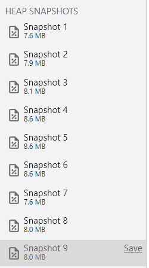
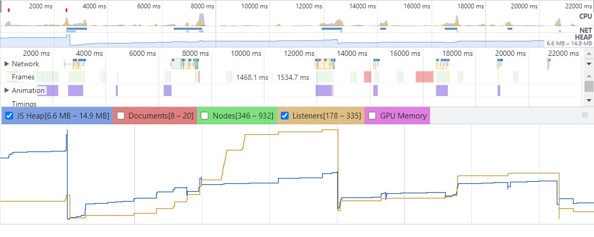

## Проверка приложения на утечки памяти

### Проверка выполнялась в браузере Google Chrome с использованием инструментов разработчика
1. Во вкладке _Memory_ делались снимки количества используемой памяти после взаимодействия с элементами приложения, в т. ч. и с Canvas 

2. Количество используемой памяти находится в одном диапазоне
3. Во вкладке _Performance_ была включена запись (с включенной опцией _Memory_) и повторены действия по взаимодействию с приложением

4. График JS Heap и Listeners показывает, что потребляемая память и обработчики очищаются

### Выводы
Утечек памяти не обнаружено